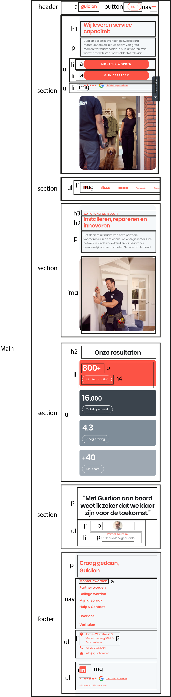

# Procesverslag
Markdown is een simpele manier om HTML te schrijven.  
Markdown cheat cheet: [Hulp bij het schrijven van Markdown](https://github.com/adam-p/markdown-here/wiki/Markdown-Cheatsheet).

Nb. De standaardstructuur en de spartaanse opmaak van de README.md zijn helemaal prima. Het gaat om de inhoud van je procesverslag. Besteedt de tijd voor pracht en praal aan je website.

Nb. Door *open* toe te voegen aan een *details* element kun je deze standaard open zetten. Fijn om dat steeds voor de relevante stuk(ken) te doen.

## Jij

  
uitwerken voor kick-off werkgroep

  ### Auteur:
 Pepijn de Wolff

  #### Je startniveau:
  Blauw

  #### Je focus:
  Responsive
 

## Je website

  
uitwerken voor kick-off werkgroep

  ### Je opdracht:
  https://www.guidion.net

  #### Screenshot(s) van de eerste pagina (small screen): 
  Guidion.net  
  

  #### Screenshot(s) van de tweede pagina (small screen):
  Guidion.net/monteur-worden 
  
 

## Toegankelijkheidstest 1/2 (week 1)

  
uitwerken na test in 1e werkgroep

  ### Bevindingen
  Lijst met je bevindingen die in de test naar voren kwamen:

  #### Screenreader
Werkt goed, alles wordt gelezen door screenreader

  #### Muis en Toetsenbord 
Werkt

  #### Motoriek (shocks, elastiekjes)
NVT

  #### Visueel (brillen, contrast, kleurenblind, dark/light). 
NVT

## Breakdownschets (week 1)

  
uitwerken na afloop 2e werkgroep

  ### de hele pagina: 
  

## Voortgang 1 (week 2)

  
uitwerken voor 1e voortgang

  ### Stand van zaken
  hier dit ging goed & dit was lastig (neem ook screenshots op van delen van je website en code)

  ### Agenda voor meeting
  samen met je groepje opstellen

  | Pepijn     | student 2          | student 3    | student 4        |
  | ---            | ---                | ---          | ---              |

  ### Verslag van meeting
Bekeken door Quinten

- HTML was semantisch geschreven
- Opzoeken andere elementen ipv div's

## Voortgang 2 (week 3)

  
uitwerken voor 2e voortgang

  ### Stand van zaken
Loop achter met groot deel ivm minor, moet nog beginnen met CSS

  ### Agenda voor meeting
  samen met je groepje opstellen

  | Pepijn     | student 2          | student 3    | student 4        |
  | ---            | ---                | ---          | ---              |

  ### Verslag van meeting
Ben opnieuw begonnen met website. Wat ik tot nu toe heb staan is helemaal goed. 
- Blocknote ipv P voor quotes op website
- Mag gebruik maken van DIV als het echt niet anders kan.

## Toegankelijkheidstest 2/2 (week 4)

  
uitwerken na test in 8e werkgroep

  ### Bevindingen
  Lijst met je bevindingen die in de test naar voren kwamen (geef ook aan wat er verbeterd is):

  #### Screenreader
  Hier korte omschrijving (met indien nodig afbeeldingen)

  Hier een omschrijving van hoe het opgelost kan worden (met indien nodig afbeeldingen)

  #### Muis en Toetsenbord 
  Hier korte omschrijving (met indien nodig afbeeldingen)

  Hier een omschrijving van hoe het opgelost kan worden (met indien nodig afbeeldingen)

  #### Motoriek (shocks, elastiekjes)
  Hier korte omschrijving (met indien nodig afbeeldingen)

  Hier een omschrijving van hoe het opgelost kan worden (met indien nodig afbeeldingen)

  #### Visueel (brillen, contrast, kleurenblind, dark/light). 
  Hier korte omschrijving (met indien nodig afbeeldingen)

  Hier een omschrijving van hoe het opgelost kan worden (met indien nodig afbeeldingen)

## Voortgang 3 (week 4)

  
uitwerken voor 3e voortgang

  ### Stand van zaken
NVT was ziek

## Eindgesprek (week 5)

  
EINDGESPREK was FEEDBACK moment

  ### Je uitkomst

  ### Dit ging goed/Heb ik geleerd: 

  ### Dit was lastig/Is niet gelukt:

## bugs 

## Bronnenlijst

 

Header hamburgermenu is niet meer leesbaar bij media query 992 px. 

Header media query spreek ik aan voor header nav:first-of-type ul li 

Dat betekend dat ik niet het hamburger menu aanspreek, tocht is het hamburger menu niet leesbaar.

  
continu bijhouden terwijl je werkt

  Nb. Wees specifiek ('css-tricks' als bron is bijv. niet specifiek genoeg).

  1. https://www.w3schools.com/css/css_form.asp
  2. https://www.w3schools.com/tags/att_input_placeholder.asp
  3. https://www.sitepoint.com/css-viewport-units-quick-start/#:~:text=vh%20stands%20for%20viewport%20height,100%25%20of%20the%20viewport%20height.
  4. https://www.w3schools.com/howto/tryit.asp?filename=tryhow_css_style_hr
  5. https://www.w3schools.com/howto/howto_js_mobile_navbar.asp
  6. https://www.youtube.com/watch?v=EiNiSFIPIQE&t=134s
  7. https://developer.mozilla.org/en-US/docs/Web/CSS/object-fit?retiredLocale=nl
  8. https://www.youtube.com/watch?v=nAjR0Oj0J8E
  9. https://css-tricks.com/inclusively-hidden/
  10. https://www.w3schools.com/html/html_favicon.asp
  11. https://www.w3schools.com/howto/howto_css_zoom_hover.asp

  12. https://codepen.io/frostycode/pen/vYGredV hamburger menu

